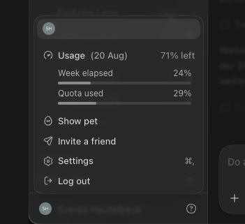

# Codex Limit Pacer

Keep your weekly Codex limit on pace.

> [!IMPORTANT]
> Codex 26.901.41600 requires **Pacer 1.0.8 or newer**. Earlier Pacer versions use a usage-request interface that Codex no longer supports.



Limit Pacer lives right below **Usage** in your Codex account menu.

## Install

1. Download the latest [DMG](../../releases/latest).
2. Drag **Codex Limit Pacer** to **Applications**, then open it.
3. Open your account menu. If the rows are missing, choose **Restart Codex with menu access…** from the Pacer menu when it is safe.

It adds the reset date, **Week elapsed**, and **Quota used**. No Settings visit, copied reset date, or extra login.
Published DMG releases are universal apps signed with Developer ID and notarized by Apple. Local source builds use ad-hoc signing by default.

## Updates

Version 1.0.8 adds optional updates through [Sparkle](https://sparkle-project.org/).
In the Pacer menu, choose **Check for Updates…** to check and install manually.
**Automatically Check for Updates** and **Automatically Install Updates** are both off by default.
Enabling automatic installation also enables daily checks; disabling checks turns automatic installation off.
Users on 1.0.7 or earlier need to install 1.0.8 manually once.

Update checks contact GitHub for release metadata; they do not include your Codex session or usage data.
System profiling is disabled. Update feeds and downloads are verified with Ed25519 signatures;
published apps are also Developer ID signed and notarized by Apple.
Updating restarts Pacer only.

## Notes

- Independent, unofficial, and not affiliated with OpenAI.
- Reads the signed-in desktop session locally once per minute; it never stores tokens or sends telemetry.
- It reads usage through Codex’s loaded desktop HTTP client, which handles the signed-in session. This is undocumented behavior, so a Codex update may require a Pacer update.
- When Pacer is already running, it automatically relaunches a freshly opened Codex with local menu access.
- Temporary connection failures are retried silently. Pacer never opens an automatic restart prompt over an existing Codex session; a manual restart remains available from its menu.

## Build from source

Requires macOS 13+, Apple Command Line Tools, and internet access for the first build.
The build downloads Sparkle 2.9.6 from its official release and verifies the pinned SHA-256 checksum:

```sh
xcode-select --install
Scripts/build-app.sh
```

Or double-click **Install Codex Limit Pacer.command** to build and install it locally.

## Publishing a release

Set `CODESIGN_IDENTITY` to your Developer ID Application identity and `NOTARY_PROFILE`
to an existing `notarytool` Keychain profile, then run `Scripts/build-release.sh`.
The Sparkle signing key stays in the macOS Keychain under account `studio.morje.codexusagepace`;
its public key must match `SUPublicEDKey` in `Info.plist`.
Increase `CFBundleVersion` for every update, including rebuilds of the same version.

Upload the generated DMG, ZIP, and **appcast.xml** from `build/release/` to the same
GitHub release tagged `v<version>`, then publish it as the latest release.
The app reads the feed from the latest release's `appcast.xml` asset. Do not edit the
signed feed after generation. Keep the signing Keychain backed up; never commit private keys.

The project is [MIT licensed](LICENSE). Sparkle's license is included in its bundled framework.

Built by Lukas van Uden · [X](https://x.com/LukasvanUden) · [LinkedIn](https://www.linkedin.com/in/lukas-van-uden/)
